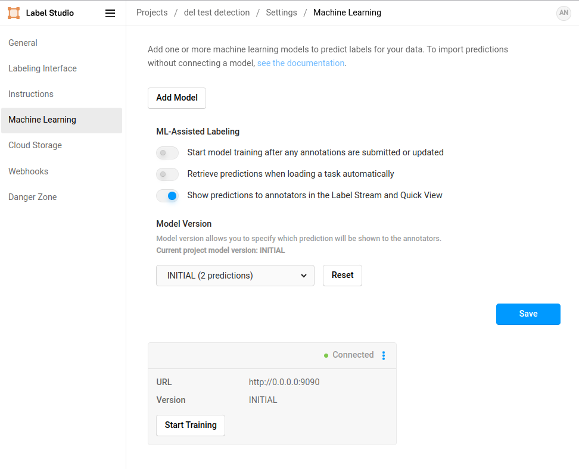

# Yolov8 Detection Label Studio Active Learning

## Setup

```bash
cd LabelStudio-Yolov8-Detection-Backend
```

- Install libraries

```bash
pip install -r requirements.txt
```

- Set environment variables

```bash
export LABEL_STUDIO_ML_BACKEND_V2=True
```

- Set path in yolov8.py, use absolute path

```python 
# labelstudio annotation: "image": "/data/upload/20/image1.png" or "image": "/data/local-files/?d=LABEL_STUDIO_LOCAL_FILES_DOCUMENT_ROOT/image1.png"
LABELSTUDIO_PATH = '/data/upload/20' 
DATASET_ROOT_DIR = '/home/user/apps/label-studio/media/upload/20' # folder where your images is store
STORAGE_DIR = '/home/user/LabelStudio-Yolov8-Detection-Backend/data' # folder to save training artifacts
MODEL_NAME = 'yolov8n_custom' # name your model
MODEL_INIT = '/home/user/LabelStudio-Yolov8-Detection-Backend/model/yolov8n.pt' # model init
MODEL_LATEST = f'/home/user/LabelStudio-Yolov8-Detection-Backend/runs/detect/{MODEL_NAME}/weights/best.pt' # latest model updated after each training
DETECTION_YAML = '/home/user/LabelStudio-Yolov8-Detection-Backend/data/detection.yaml' # your yaml for training yolov8
```

- Setup yolov8 dataset yaml in data/detection.yaml

```yaml 
train: /home/user/LabelStudio-Yolov8-Detection-Backend/data/images
val: /home/user/LabelStudio-Yolov8-Detection-Backend/data/images

nc: 2
names: ['table', 'signature']
```

## Create - launch - connect ML backend server 

- Run in terminal

```bash
label-studio-ml init yolov8_backend --script yolov8.py --force

label-studio-ml start yolov8_backend
```

- Connect Label Studio with ML backend



